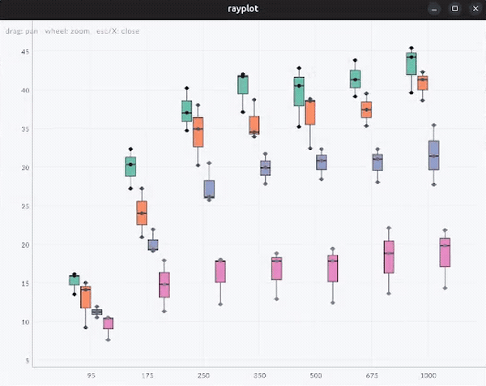
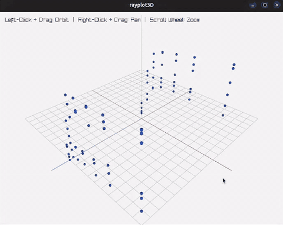

# rayplot

**Write [ggplot2](https://ggplot2.tidyverse.org/) as you already do — get an
interactive [raylib](https://www.raylib.com/) window with mouse pan, scroll
zoom and hover tooltips for free.**

`rayplot` is a toy/playground package: it calls `ggplot2::ggplot_build()` on your
plot, translates each computed layer into a small typed struct, and hands that to
a raylib render loop. The loop is pumped cooperatively from R's event loop via
[`later`](https://r-lib.github.io/later/), so the console stays usable while the
window is open.



## Install

**raylib is vendored** (`src/raylib/`, raylib 5.5) and compiled with the
package — you do **not** need a system raylib. You only need a C toolchain and,
on Linux, the OpenGL + X11 development headers:

```sh
# Debian / Ubuntu
sudo apt-get install build-essential libgl1-mesa-dev xorg-dev
```

```r
# install.packages("remotes")
remotes::install_github("Konrad1991/rayplot")
```

Linux (X11) is the tested build; on Wayland the window runs via XWayland. A
native Wayland backend is possible with the bundled GLFW 3.4 — see the note in
`src/Makevars`. macOS / Windows blocks exist in `src/Makevars*` following
raylib's own flags but are untested — issues and PRs welcome.

## Usage

```r
library(ggplot2)
library(rayplot)

p <- ggplot(CO2, aes(
    x = factor(conc), y = uptake,
    group = interaction(conc, Treatment, Type)
  )) +
  geom_boxplot(
    aes(fill = interaction(Treatment, Type)),
    position = position_dodge(width = 0.8)
  ) +
  geom_point(
    aes(colour = interaction(Treatment, Type)),
    position = position_dodge(width = 0.8)
  ) +
  scale_fill_brewer(palette = "Set2") +
  scale_colour_grey(start = 0.1, end = 0.5) +
  theme(legend.position = "none")

rayplot(p)
```

* **drag** to pan, **scroll wheel** to zoom, **hover** a point / box for a tooltip,
  **Esc** or the window's close button to quit.
* The window is non-blocking — keep working in the console; call
  `rayplot_close()` to close it.
* Only **one window at a time** (raylib has a single GL context): calling
  `rayplot()` or `rayplot3D_scatter()` again closes the current window first.
* Each layer keeps its own colour palette, taken from that layer's `fill` /
  `colour` aesthetic, so give the two scales different palettes if you want the
  points to differ from the boxes.

## How it works

```
ggplot(p)  ->  ggplot_build(p)  ->  per-layer spec (list of vectors)  ->  .Call  ->  C structs  ->  raylib loop
```

Everything happens in data coordinates, so pan/zoom stay meaningful (it is not a
static raster). Adding support for a new geom is an R-side translation function
in [`R/ggplot.R`](R/ggplot.R) plus, if the shape is new, a C struct in
[`src/2D/`](src/2D/) — no new architecture.

**Supported today:** `geom_point`, `geom_boxplot` (cartesian coords, one panel).
Anything else raises a clear error.

## 3D (experimental)



**From a ggplot:** map a `z` aesthetic and `rayplot()` opens the orbit-camera
3D renderer instead of the 2D window. `geom_point` gives a scatter,
`geom_line`/`geom_area` give one trace/curtain per `group` (e.g. a waterfall
of stacked slices), and `geom_tile`/`geom_raster` give a continuous height
surface over a complete x/y grid.

A relative-error surface from curve fitting is a good real-world example —
here the classic Rosenbrock function stands in for a fit's error landscape
over two parameters:

```r
rosenbrock <- function(x, y) (1 - x)^2 + 100 * (y - x^2)^2
grid <- expand.grid(x = seq(-2, 2, length.out = 500), y = seq(-2, 2, length.out = 500))
grid$error <- rosenbrock(grid$x, grid$y)

p <- ggplot(grid, aes(x = x, y = y, z = log1p(error), fill = log1p(error))) +
  geom_tile() +
  scale_fill_viridis_c()

rayplot(p)                 # 3D surface, 250k cells, still smooth
```

**Direct:** pass `x`, `y`, `z` vectors (more knobs, e.g. `point_radius`):

```r
h <- rayplot3D_scatter(
  CO2$conc, CO2$uptake, as.numeric(CO2$Treatment),
  point_radius = 0.1
)
rayplot3D_close(h)         # or rayplot_close() for the open window
```

* **left-drag** orbit, **right-drag** pan, **scroll wheel** zoom, **hover** a
  point / trace / surface cell for a tooltip.
* `fill`/`z` must be mapped to the same value to colour a surface by height
  (`aes(z = error, fill = error)`) -- otherwise it draws in a flat colour.
* `geom_area`'s 3D curtain needs `stat = "identity", position = "identity"`;
  its defaults are built for 2D stacked area charts and will distort
  independent per-`z` curtains. `geom_boxplot` etc. stay 2D.

## Browser / WebAssembly (experimental)

`rayplot_web(p, "plot.html")` writes a self-contained page that renders the plot
in the browser. R builds the same per-layer spec, serialises it to a binary
blob, and the page draws it with an Emscripten build of the *same* C render core
— pan / zoom / tooltips run client-side, R is not involved after export.

The WebAssembly module is not prebuilt — build it once with the Emscripten SDK:

```sh
source /path/to/emsdk/emsdk_env.sh
inst/web/build.sh        # -> inst/web/rayplot.js + rayplot.wasm
```

### In Shiny

```r
ui <- fluidPage(
  rayplotCanvas("plot", 900, 620)
)
server <- function(input, output, session) {
  observe({
    p <- ggplot(CO2, ...) + scale_fill_brewer(palette = input$pal) + ...
    rayplot_send(p, "plot", width = 900L, height = 620L)
  })
}
```

One `<canvas>`, the module loaded once; each update is a few-KB websocket
message — no iframe, no reload. See [`inst/web/README.md`](inst/web/README.md).

## Status & contributing

This is a playground for wiring raylib into R, not a production plotting package.
The most useful contributions are new geoms — each is a self-contained task
(`geom_line`, `geom_col`, `geom_smooth`, …). See `R/ggplot.R` for the pattern.

## License

GPL-3. Bundled third-party components:

* [raylib](https://www.raylib.com/) 5.5 — zlib/libpng licence
  (`src/raylib/LICENSE`), including GLFW (zlib, `src/raylib/external/glfw/LICENSE.md`).
* [Lato](https://fonts.google.com/specimen/Lato) font — SIL Open Font License 1.1
  (`inst/fonts/OFL.txt`).
